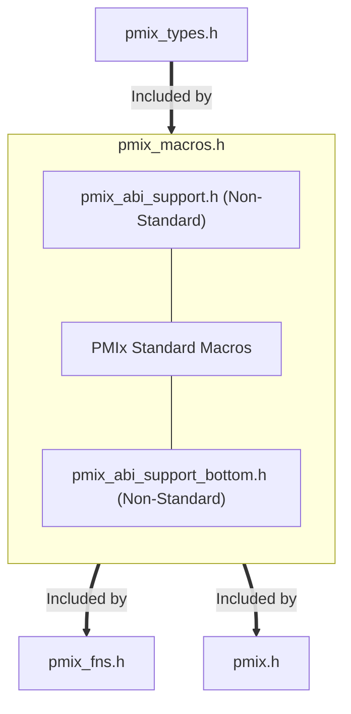

# PMIx Standard ABI Headers

## Layout of the headers

 * `pmix_types.h` : PMIx Standard types, constants, and callback functions
 * `pmix_macros.h` : PMIx Standard macros
   * `pmix_abi_support.h` : Non-standard support functions (prefixed with `pmixabi_`) to support the macro definitions
   * `pmix_abi_support_bottom.h` : Non-standard support functions (prefixed with `pmixabi_`) to support the macro definitions. These few functions also use the macros. As such, they need to be included at the bottom of `pmix_macros.h`
 * `pmix_fns.h` : PMIx Standard API function pointer declarations for PMIx Standard APIs
   * The goal of this header to ease the incorporation of PMIx routines for applications and tools that wish to `dlopen()` a PMIx Standard compliant library and then `dlsym()` the various functions.

## Using dlopen/dlsym

If your application intends to use the headers with `dlopen()` and `dlsym()` then the `pmix_fns.h` header is all that you need to include to use the PMIx Standard interface. The function pointer signatures are defined in `pmix_fns.h` in a form approprate for `dlsym()`
